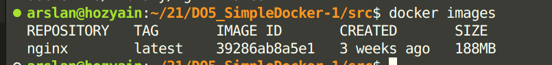

# Отчет по DO5_SimpleDocker-1      
## Part 1. Готовый докер  
- Возьми официальный докер-образ с nginx и выкачай его при помощи docker pull.  
<figure>
    
    <figcaption>скачаиваем nginx</figcaption>
</figure> 

- Проверь наличие докер-образа через docker images.  
<figure>
    
    <figcaption>провеярем наличие образа</figcaption>
</figure>

- Запусти докер-образ через docker run -d [image_id|repository].  
<figure>
    
    <figcaption>запуск докер-образа</figcaption>
</figure>

- Проверь, что образ запустился через docker ps.  
<figure>
    
    <figcaption>вывод docker ps</figcaption>
</figure>

- Посмотри информацию о контейнере через docker inspect [container_id|container_name].
<figure>
    
    <figcaption>вывод docker inspect</figcaption>
</figure>

- По выводу команды определи и помести в отчёт размер контейнера, список замапленных портов и ip контейнера.
<figure>
    
    <figcaption>ip</figcaption>
    
    <figcaption>список замапленных портов</figcaption>
    
    <figcaption>размер контейнера</figcaption>
</figure>

- Останови докер образ через docker stop [container_id|container_name].  
- Проверь, что образ остановился через docker ps. 
- Запусти докер с портами 80 и 443 в контейнере, замапленными на такие же порты на локальной машине, через команду run.  
<figure>
    
    <figcaption>останаваливаем докер</figcaption>
    
    <figcaption>docker ps</figcaption>
</figure>

- Проверь, что в браузере по адресу localhost:80 доступна стартовая страница nginx.
<figure>
    
    <figcaption>страница есть</figcaption>
</figure>

- Перезапусти докер контейнер через docker restart [container_id|container_name].  
- Проверь любым способом, что контейнер запустился.  
<figure>
    
    <figcaption>перезапускаем докер и вывод docker ps</figcaption>
</figure>

## Part 2. Операции с контейнером  

- Прочитай конфигурационный файл nginx.conf внутри докер контейнера через команду exec.  
<figure>
    
    <figcaption>читаем конфиг файл</figcaption>
</figure> 

- Создай на локальной машине файл nginx.conf.  
- Настрой в нем по пути /status отдачу страницы статуса сервера nginx.  
<figure>
    
    <figcaption>создаем на локальной машине конфиг файл</figcaption>
</figure> 

- Скопируй созданный файл nginx.conf внутрь докер-образа через команду docker cp.  
<figure>
    
    <figcaption>копируем конфиг файл</figcaption>
</figure> 

- Перезапусти nginx внутри докер-образа через команду exec.  
<figure>
    
    <figcaption>перезапускаем nginx</figcaption>
</figure> 

- Проверь, что по адресу localhost:80/status отдается страничка со статусом сервера nginx.  
<figure>
    
    <figcaption>открывем страницу</figcaption>
</figure> 

- Экспортируй контейнер в файл container.tar через команду export.  
<figure>
    
    <figcaption>экспортирую контейнер</figcaption>
</figure> 

- Останови контейнер.  
<figure>
    
    <figcaption>останавливаю контейнер</figcaption>
</figure> 

- Удали образ через docker rmi [image_id|repository], не удаляя перед этим контейнеры.  
<figure>
    
    <figcaption>удаляю образ через docker rmi</figcaption>
</figure> 

- Удали остановленный контейнер.  
<figure>
    
    
    <figcaption>удаляю контейнер</figcaption>
</figure> 

- Импортируй контейнер обратно через команду import.  
<figure>
    
    <figcaption>docker import</figcaption>
</figure> 

- Запусти импортированный контейнер.  
<figure>
    
    <figcaption>docker run</figcaption>
</figure> 

- Проверь, что по адресу localhost:80/status отдается страничка со статусом сервера nginx.  
<figure>
    
    <figcaption>содержание страницы</figcaption>
</figure> 

## Part 3. Мини веб-сервер  
- Напиши мини-сервер на C и FastCgi, который будет возвращать простейшую страничку с надписью Hello World!.  
<figure>
    
    <figcaption>содержание server.c</figcaption>
</figure> 
- Напиши свой nginx.conf, который будет проксировать все запросы с 81 порта на 127.0.0.1:8080.  
<figure>
    
    <figcaption>содержание nginx.conf</figcaption>
</figure> 
<figure>
    
    
    <figcaption>копируем внутрь контейнера, затем переходим в интерактивный режим</figcaption>
</figure> 

предварительно скачиваем библиотки: apt update  
apt-get install libfcgi-dev  
apt-get install spawn-fcgi  
apt-get install gcc  

- Запусти написанный мини-сервер через spawn-fcgi на порту 8080.  
<figure>
    
    <figcaption>компилирую и запускаю</figcaption>
</figure> 

- Проверь, что в браузере по localhost:81 отдается написанная тобой страничка.  
<figure>
    
    <figcaption>содержание страницы</figcaption>
</figure> 

- Положи файл nginx.conf по пути ./nginx/nginx.conf (это понадобится позже).   

## Part 4. Свой докер  

- Напиши свой докер-образ, который:  
1) собирает исходники мини сервера на FastCgi из Части 3;

2) запускает его на 8080 порту;

3) копирует внутрь образа написанный ./nginx/nginx.conf;

4) запускает nginx.
<figure>
    
    <figcaption>содержание файла файла Docker</figcaption>
</figure> 

Собери написанный докер-образ через docker build при этом указав имя и тег.  
<figure>
    
    
    <figcaption>собираю</figcaption>
</figure> 

Проверь через docker images, что все собралось корректно.  
<figure>
    
    <figcaption>docker images</figcaption>
</figure> 

Запусти собранный докер-образ с маппингом 81 порта на 80 на локальной машине и маппингом папки ./nginx внутрь контейнера по адресу, где лежат конфигурационные файлы nginx'а (см. Часть 2).  
<figure>
    
    <figcaption>запускаю образ</figcaption>
</figure> 

Проверь, что по localhost:80 доступна страничка написанного мини сервера.  
<figure>
    
    <figcaption>содержание страницы</figcaption>
</figure> 

Допиши в ./nginx/nginx.conf проксирование странички /status, по которой надо отдавать статус сервера nginx.  
<figure>
    
    <figcaption>изменяю конфиг файл</figcaption>
</figure> 

Перезапусти докер-образ.  
Проверь, что теперь по localhost:80/status отдается страничка со статусом nginx  
Проверь, что теперь по localhost:80/status отдается страничка со статусом nginx  
<figure>
    
    <figcaption>перезапуск и содержание страницы</figcaption>
</figure>  

## Part 5. Dockle  

- Просканируй образ из предыдущего задания через dockle [image_id|repository].  
<figure>
    
    
    <figcaption>сканирую образ через dockle (пришлось запушить на docker hub, иначе не работало)</figcaption>
</figure>  

- Исправь образ так, чтобы при проверке через dockle не было ошибок и предупреждений.  
<figure>
    
    
    <figcaption>переделываю докерфайл(изменяю права доступа к некторым файлам, добавляю healthcheck, меняю пользователя, очищаю кэш пакетов apt)</figcaption>
</figure>  
<figure>
    
    <figcaption>так же написал sh скрипт для запуска FastCGI приложения</figcaption>
</figure>  
<figure>
    
    
    <figcaption>вывод dockle после изменений (оставшаяся ошибка связана с обновлением nginx из-за чего dockle выдает ошибку)</figcaption>
</figure>  

## Part 6. Базовый Docker Compose  

- Напиши файл docker-compose.yml, с помощью которого:

1) Подними докер-контейнер из Части 5 (он должен работать в локальной сети, т.е. не нужно использовать инструкцию EXPOSE и мапить порты на локальную машину).

<figure>
    
    <figcaption>поднял докер-контейнер из Части 5</figcaption>
</figure>  

2) Подними докер-контейнер с nginx, который будет проксировать все запросы с 8080 порта на 81 порт первого контейнера.

<figure>
    
    <figcaption>поднял докер-контейнер с nginx</figcaption>
</figure>  

- Замапь 8080 порт второго контейнера на 80 порт локальной машины.

<figure>
    
    <figcaption>yaml файл</figcaption>
</figure>  

- Останови все запущенные контейнеры.  
<figure>
    
    <figcaption>остановил</figcaption>
</figure>  

- Собери и запусти проект с помощью команд docker-compose build и docker-compose up.  
<figure>
    
    
    <figcaption>build</figcaption>
</figure>  
<figure>
    
    
    <figcaption>up</figcaption>
</figure>  

- Проверь, что в браузере по localhost:80 отдается написанная тобой страничка, как и ранее.  
<figure>
    
    <figcaption>показываю, что контейнеры запустились, затем содержание страницы</figcaption>
</figure> 
